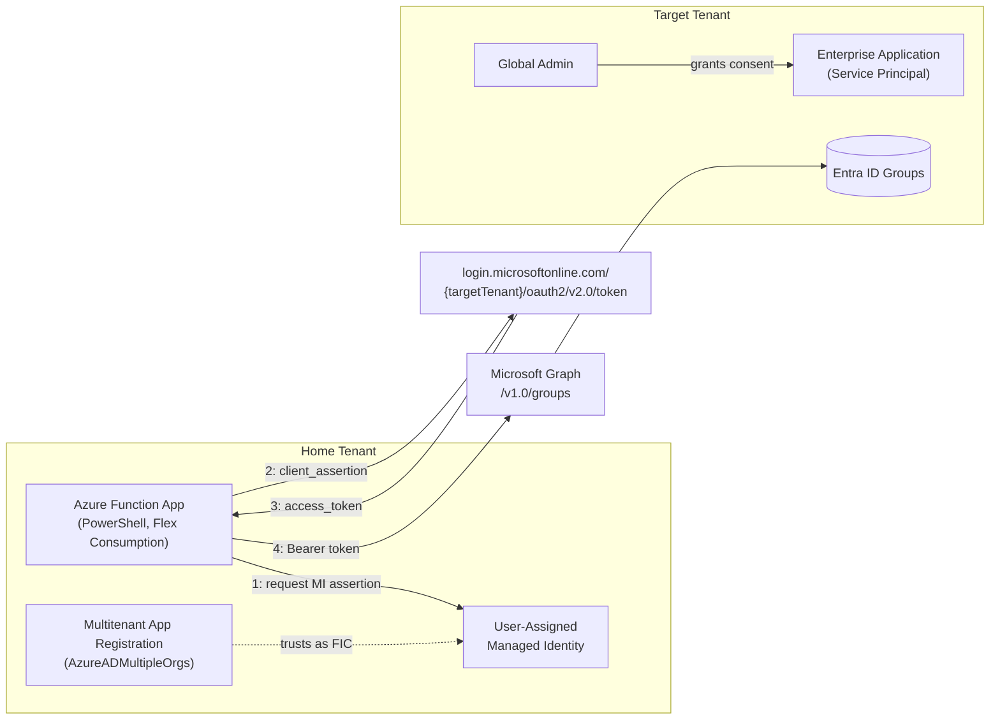

# AzureCrossTenantManagedIdentity

Read Microsoft Entra ID data from a **different (customer) tenant** out of an Azure Function, using only a **User-Assigned Managed Identity (UAMI)** as a **Federated Identity Credential (FIC)** on a **multitenant App Registration** - with no client secret or certificate ever created, stored, or rotated.

## How it works

1. The Azure Function App (home tenant) has a User-Assigned Managed Identity attached.
2. A multitenant App Registration (`signInAudience: AzureADMultipleOrgs`), also in the home tenant, trusts that Managed Identity via a Federated Identity Credential.
3. A target tenant administrator grants admin consent to the multitenant application, creating an Enterprise Application (Service Principal) there.
4. At runtime, the Function requests a Managed Identity token for `api://AzureADTokenExchange`, and exchanges it as a **client assertion** for a Microsoft Graph access token issued by the **target tenant**.
5. That access token is used to call Microsoft Graph and read the target tenant's groups.



## Repository structure

```text
Scripts/                                    Provisioning scripts (run in numeric order)
  0-New-CrossTenantAzureResources.ps1        Resource Group, Storage, UAMI, App Insights, Function App
  1-New-CrossTenantFederatedApp.ps1          Multitenant App Registration + Federated Identity Credential
  2-New-PSMDTemplate.ps1                     Scaffolds the Function App project (run once)
  3-New-GitHubActionsFederatedApp.ps1        Separate CI/CD deployment identity (GitHub Actions OIDC)

AzureFunctionApp/CrossTenantFunctionApp/     The Function App project (PSFramework/PSModuleDevelopment template)
  CrossTenantFunctionApp/functions/
    httpTrigger/                             Public HTTP endpoints (one file = one endpoint)
    nonPublished/                            Internal helper functions, never exposed as endpoints
  build/                                     Build tooling - do not touch, except build.config.psd1

.github/workflows/deploy-function.yml        CI/CD: build + publish via GitHub Actions OIDC (no stored Azure secret)
```

## Getting started

Run the provisioning scripts **in order** from the `Scripts/` folder. Each is idempotent and safe to re-run.

```powershell
# 0) Azure resources (home tenant): Resource Group, Storage, Managed Identity, App Insights, Function App
.\Scripts\0-New-CrossTenantAzureResources.ps1 -ResourceGroupName 'crosstenant-rg' -Location 'germanywestcentral' `
    -StorageAccountName 'chcrosstenantstorage001' -FunctionAppName 'chcrosstenantfuncapp001' `
    -UserAssignedIdentityName 'chcrosstenantuami001'

# 1) Multitenant App Registration + Federated Identity Credential (uses the output from step 0)
.\Scripts\1-New-CrossTenantFederatedApp.ps1 -HomeTenantId '<home-tenant-id>' `
    -UserAssignedIdentityObjectId '<uami-object-id>' -UserAssignedIdentityName 'chcrosstenantuami001' `
    -UserAssignedIdentityResourceGroup 'crosstenant-rg'

# 2) Scaffold the Function App project (only needed once, before adding custom functions)
.\Scripts\2-New-PSMDTemplate.ps1

# 3) (Optional) CI/CD deployment identity for GitHub Actions
.\Scripts\3-New-GitHubActionsFederatedApp.ps1 -HomeTenantId '<home-tenant-id>' -SubscriptionId '<subscription-id>' `
    -ResourceGroupName 'crosstenant-rg' -GitHubOrganization '<org>' -GitHubRepository '<repo>'
```

After step 1, send the printed admin-consent URL to a Global Administrator in the **target** tenant to complete the trust.

## Deployment

`.github/workflows/deploy-function.yml` builds and publishes the Function App on every push to `main` under `AzureFunctionApp/CrossTenantFunctionApp/**`, or via manual dispatch. It signs in to Azure with `azure/login@v2` using OIDC (the identity from script 3) - no Azure client secret is stored in GitHub.

Required repository secrets/variables (see [Scripts/gh.txt](Scripts/gh.txt) for `gh` CLI commands):

| Type     | Name                     |
| -------- | ------------------------ |
| Secret   | `AZURE_CLIENT_ID`        |
| Secret   | `AZURE_TENANT_ID`        |
| Secret   | `AZURE_SUBSCRIPTION_ID`  |
| Variable | `AZURE_FUNCTIONAPP_RG`   |
| Variable | `AZURE_FUNCTIONAPP_NAME` |

The workflow runs on `windows-latest` - the build script's module bootstrap assumes a Windows-style `PSModulePath`.

## Usage

Only `Get-CrossTenantEntraIdGroups` is exposed as an HTTP endpoint (`Get-CrossTenantAccessToken` is an internal helper under `functions/nonPublished`):

```
GET https://<function-app-name>.azurewebsites.net/api/Get-CrossTenantEntraIdGroups?TenantId=<target-tenant-id>&ClientId=<app-registration-client-id>&code=<function-key>
```

## Security

- No client secret or certificate is ever created for the cross-tenant trust - only a short-lived, platform-issued Managed Identity token used as a client assertion.
- `Group.Read.All` is requested as an **application** permission (least privilege by default), consented explicitly by the target tenant's administrator.
- The CI/CD deployment identity is a separate, single-tenant App Registration from the multitenant runtime application.

## License

[MIT](LICENSE) © Constantin Hager
